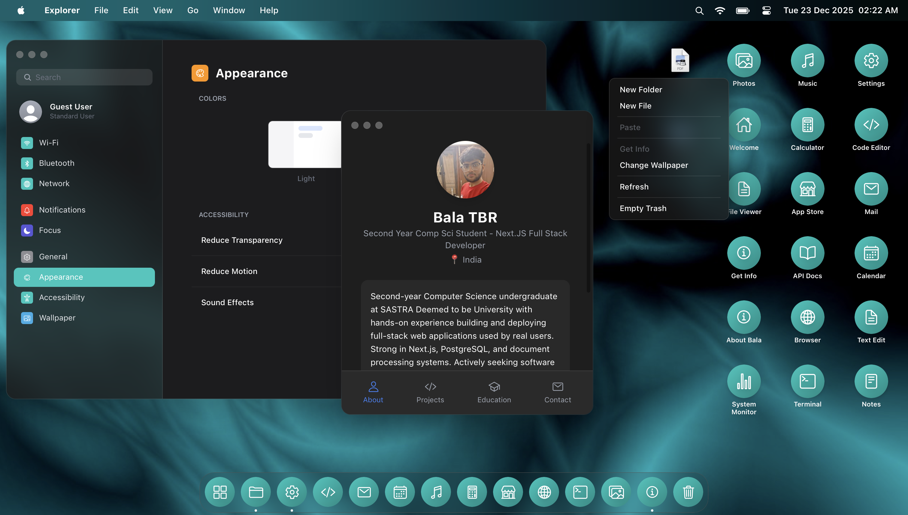

# NextarOS

**Production URL:** [https://baladev.in](https://baladev.in)

A **local-first Web Operating System** runtime with multi-user support, offline execution, virtual filesystem, and a permissioned app ecosystem - built entirely frontend-only using **Next.js 15** and **React 19**.

> **Design Language**: Inspired by Apple's macOS and iOS, reimagined for the web.



---

## Core Identity

NextarOS is not just another MacOS inspired portfolio - it's a **complete operating system simulation** running in your browser:

- **Local-First**: All data stored in IndexedDB, works completely offline
- **Multi-User**: Multiple user accounts with roles and permissions
- **Sandboxed Apps**: Third-party apps run in isolated environments
- **Virtual Filesystem**: Full hierarchical file system with MIME types
- **Process Management**: Real process spawning, suspension, and crash containment

---

## Feature List (100+)

### Desktop Environment (25 features)

| Feature | Description |
|---------|-------------|
| Window Management | Drag, resize, minimize, maximize, restore |
| Window Stacking | Z-index management with focus ordering |
| Window Snap | Snap to edges and corners |
| Menu Bar | Dynamic app-specific menus |
| Dock | Interactive dock with hover magnification |
| Dock Pinning | Pin/unpin apps to dock |
| Dock Context Menu | Right-click actions on dock items |
| Control Center | Quick toggles for settings |
| Notification Center | Slide-in notification panel |
| Next Search | Universal spotlight-style search (⌘+Space) |
| App Switcher | ⌘+Tab application switching |
| Force Quit | ⌘+Option+Esc force quit dialog |
| Desktop Icons | Drag-and-drop desktop icon grid |
| Desktop Context Menu | Right-click to create files/folders |
| Wallpaper | Customizable wallpapers |
| Theme Support | Light/dark mode with system preference |
| Accent Colors | Customizable accent color |
| Reduce Motion | Accessibility option |
| Reduce Transparency | Accessibility option |
| Sound Effects | System sounds for actions |
| Boot Screen | Animated boot sequence |
| Lock Screen | Password-protected lock screen |
| Clock Widget | Live clock on lock screen |
| Multi-Monitor Ready | Responsive layout system |
| Keyboard Shortcuts | Full keyboard navigation |

### Mobile Experience (15 features)

| Feature | Description |
|---------|-------------|
| iOS-Style Interface | Authentic mobile home screen |
| Swipeable Pages | Multiple home screen pages |
| App Grid | iOS-style icon layout |
| Long Press | Context menu on long press |
| Edit Mode | Wiggle mode for app management |
| Recent Apps | Swipe up multitasking view |
| Gesture Navigation | Swipe gestures for navigation |
| Control Center Swipe | Swipe down from corner |
| Notification Swipe | Swipe down from top |
| Full Screen Apps | Apps open in full screen |
| Touch Optimized | Touch-friendly UI elements |
| Safe Area Support | Notch and home indicator support |
| Adaptive Layout | Auto-detects device type |
| Portrait/Landscape | Orientation support |
| Pull to Refresh | Refresh gesture support |

### Virtual File System (20 features)

| Feature | Description |
|---------|-------------|
| Hierarchical Structure | Full directory tree |
| Create Files | Create new files with content |
| Create Folders | Create nested directories |
| Rename Items | Rename files and folders |
| Move Items | Cut/paste between folders |
| Copy Items | Duplicate files and folders |
| Delete Items | Permanent deletion |
| Trash System | Move to trash, restore later |
| Empty Trash | Permanent trash cleanup |
| File Upload | Upload files (IndexedDB storage) |
| File Download | Export files to disk |
| MIME Types | Automatic type detection |
| File Icons | Type-specific icons |
| File Preview | Quick look previews |
| File Info | Properties panel |
| Read-Only Support | System file protection |
| Owner Tracking | Per-user file ownership |
| User Home Folders | Isolated user directories |
| Shortcuts | Symlink-style shortcuts |
| Persistent Storage | IndexedDB persistence |

### Multi-User System (12 features)

| Feature | Description |
|---------|-------------|
| User Accounts | Create multiple users |
| Password Protection | PBKDF2 hashed passwords |
| Role System | Admin, User, Guest roles |
| Admin Privileges | Full system access |
| Guest Mode | Ephemeral session |
| User Avatars | Custom profile pictures |
| User Bios | Profile descriptions |
| User Switching | Switch between accounts |
| Last User Memory | Remember last logged in user |
| Rate Limiting | 5 attempts, 30s lockout |
| Constant-Time Compare | Timing attack protection |
| Session Management | Login/logout handling |

### Security & Permissions (15 features)

| Feature | Description |
|---------|-------------|
| Permission Model | Granular app permissions |
| Permission Dialog | User consent prompts |
| Filesystem Permissions | Read/write access control |
| Notification Permissions | System.notifications |
| Clipboard Permissions | System.clipboard |
| Theme Permissions | System.theme |
| Settings Permissions | System.settings |
| Multi-Instance Permissions | Window.multiInstance |
| Fullscreen Permissions | Window.fullscreen |
| Per-User Grants | User-specific permissions |
| Per-App Grants | App-specific permissions |
| IndexedDB Persistence | Grants persist across sessions |
| Admin Auto-Grant | Admins bypass all prompts |
| Permission Revocation | Remove granted permissions |
| Code Integrity | SHA-256 hash verification |

### External Apps Ecosystem (12 features)

| Feature | Description |
|---------|-------------|
| App Store | Browse and install apps |
| Custom Repositories | Add GitHub repos |
| App Installation | One-click install |
| App Uninstallation | Clean removal |
| App Updates | Version checking |
| App Categories | Organized by type |
| App Search | Find apps by name |
| Sandboxed Execution | Isolated app runtime |
| API Documentation | 80+ documented APIs |
| Babel Transpilation | JSX/ES6 support |
| Namespaced Storage | Per-app localStorage |
| Hash Verification | Code integrity checks |

### Built-In Apps (22 apps)

| App | Description |
|-----|-------------|
| **Explorer** | File manager with views |
| **Browser** | Sandboxed web browser |
| **Python IDE** | Monaco editor + execution |
| **Terminal** | ZSH-style command line |
| **TextEdit** | Rich text editor |
| **Notes** | Note-taking app |
| **Calendar** | Event management |
| **Calculator** | Standard calculator |
| **Photos** | Image gallery |
| **Music** | Audio player |
| **Mail** | Email client |
| **Settings** | System preferences |
| **App Store** | App marketplace |
| **API Docs** | Developer documentation |
| **About Bala** | Portfolio showcase |
| **File Viewer** | Universal file viewer |
| **File Info** | File properties |
| **Launchpad** | App launcher grid |
| **Welcome** | First-run experience |
| **System Monitor** | Process viewer |
| **About Device** | System information |
| **Tour Guide** | Interactive tutorial |

### Process Management (8 features)

| Feature | Description |
|---------|-------------|
| Process Spawning | Track running apps |
| Process IDs | Unique PIDs |
| Process States | Running, suspended, crashed |
| Suspend/Resume | Minimize = suspend |
| Force Kill | Terminate processes |
| Crash Detection | Error boundary integration |
| Crash Recovery | Try Again button |
| Process List | View all processes |

### System Services (8 features)

| Feature | Description |
|---------|-------------|
| Theme Context | Dark/light mode |
| Settings Context | User preferences |
| Notification Context | Toast and alerts |
| Device Context | Mobile/desktop detection |
| Window Context | Window management |
| Auth Context | User authentication |
| FileSystem Context | File operations |
| Permissions Context | Access control |

### Data Persistence (6 features)

| Feature | Description |
|---------|-------------|
| IndexedDB Storage | Files, users, permissions |
| LocalStorage | Settings, preferences |
| Snapshot Export | Export all data as JSON |
| Snapshot Import | Restore from backup |
| Version Migration | Schema updates |
| Offline First | Works without internet |

### PWA & Performance (10 features)

| Feature | Description |
|---------|-------------|
| Service Worker | Offline caching |
| Cache Validation | No cache poisoning |
| Lazy Loading | Dynamic imports |
| Memoization | Optimized re-renders |
| Static Export | Pre-rendered HTML |
| Web Manifest | Installable PWA |
| Apple Web App | iOS home screen support |
| Full Screen Mode | Immersive experience |
| SEO Optimized | Meta tags, structured data |
| Fast Boot | Optimized load sequence |

---

## Tech Stack

| Category | Technology |
|----------|------------|
| Framework | Next.js 15 (App Router) |
| Core | React 19 |
| Styling | Tailwind CSS |
| Animations | Framer Motion |
| Editor | Monaco Editor |
| Storage | IndexedDB + LocalStorage |
| Icons | React Icons (Ionicons) |
| Crypto | Web Crypto API |

---

## Quick Start

```bash
git clone https://github.com/invincibleinventor/nextar-os.git
cd nextar-os
npm install
npm run dev
```

Open [http://localhost:3000](http://localhost:3000)

---

## Documentation

- [Architecture Guide](./docs/ARCHITECTURE.md) - System design
- [SDK Documentation](./docs/SDK.md) - Build apps
- [API Reference](./docs/API.md) - Available APIs

---

## License

MIT License

---

**Built by [Bala TBR](https://github.com/invincibleinventor)**
