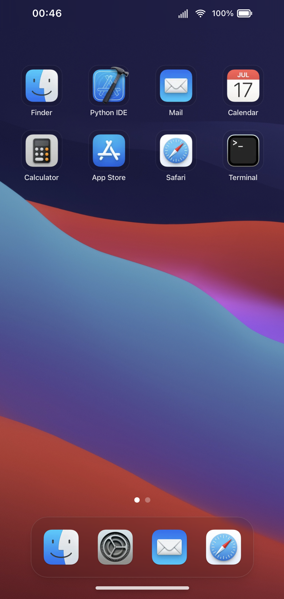

# macOS-next

**Production URL:** [https://baladev.in](https://baladev.in)

A "Portfolio OS" simulation built with **Next.js 15** and **React 19**. This project mimics a functional Operating System environment that ships a convergent UI that adapts between a macOS desktop layout and an iOS mobile interface across screen sizes. 

Default macOS UI


iOS UI (Rendered automatically on smaller screen sizes)



## 🧠 Core Architecture: Virtual File System & Deep Linking

`macOS-next` is built upon a custom architecture that simulates an operating system's logic.

### Virtual File System (VFS)
The application state is grounded in a **JSON-based directory structure (`/`)**. This is a hierarchical file system supporting:
- **MIME Types**: Differentiates between folders (`inode/directory`), images (`image/png`), text (`text/plain`), and URIs (`text/x-uri`).
- **Metadata**: Tracks file creation dates, sizes, and parent directories.
- **Dynamic Content**: Files act as objects that can trigger specific applications when interacted with.

### Deep Linking Architecture
This file system enables **app-to-app communication**, connecting different components:
- **Mail ↔️ Finder**: Clicking a GitHub project notification in the **Mail** app sends a command to **Finder** to navigate to and highlight that specific project folder.
- **Finder ↔️ Apps**:
    - Opening a `.md` or `.pdf` file resolves and renders the content in **File Viewer**.
    - Clicking an image file launches **Photos** in a modal preview state.
- **Universal Access**: Resources are addressable through this central logic layer.

---

## 🖥️ Dual Interface Design

The project features a responsive design that shifts the interface layout based on the device using CSS container queries and media matches.

### macOS (Desktop Experience)
- **Window Management**: Windowing system with dragging, resizing, minimizing, maximizing, and Z-index stacking.
- **Control Center**: Panel for managing system connectivity (Wi-Fi, Bluetooth), Display Brightness, and Sound Volume.
- **Notification System**: Aggregates alerts, system messages, and app notifications.
- **Dock**: Interactive dock with magnification animations.
- **Menu Bar**: Functional global menu bar with dynamic app-specific menus (File, Edit, View, Window, Help).

### iOS (Mobile Experience)
- **Convergent Design**: Interface transforms into a touch-optimized iOS layout on smaller screens.
- **Home Screen & Library**: Swipeable home pages and a searchable App Library.
- **Touch Gestures**: Swipe gestures for navigation between screens.
- **Adaptive Apps**: Windowed apps transform into full-screen mobile experiences with bottom-sheet multitasking interactions.

## 🚀 Applications

### 📁 Finder
File manager. Browse projects, documents, and system files in List, Icon, or Gallery views. Supports navigation history (Back/Forward) and breadcrumbs.

### 🌐 Safari
Browser simulation. Renders external websites or internal portfolio projects within an iframe, complete with address bar navigation.

### 💻 Terminal
Interactive `zsh` simulation.
- Run commands like `ls`, `cd`, `cat`, `echo`, `clear`.
- Execute Easter eggs and system commands.
- View project details via CLI.

### ✉️ Mail
Email client simulation showcasing portfolio messages.
- **Integration**: Emails from "GitHub" about projects contain "View in Finder" buttons that deep-link directly to the project's assets in the file system.

### 📸 Photos
Gallery application to view project screenshots and personal photos.
- **Integration**: Works with Finder to preview image files.

### ⚙️ Settings
System control panel.
- **Theming**: Toggle Dark/Light mode.
- **Wallpapers**: Change the desktop background.

### 📝 File Viewer
Document reader.
- Renders Markdown (READMEs), Plain Text, and PDFs (Resume).

### 🐍 Python
Added for those python enthusiasts who look around for python everywhere :P

## 🛠️ Tech Stack

- **Framework**: [Next.js 15](https://nextjs.org/) (App Router)
- **Core**: [React 19](https://react.dev/)
- **Styling**: [Tailwind CSS](https://tailwindcss.com/)
- **Animations**: [Framer Motion](https://www.framer.com/motion/) & [GSAP](https://greensock.com/gsap/)
- **State Management**: React Context & Hooks (Window Manager, File System)

## Getting Started

1. Clone the repository:
   ```bash
   git clone https://github.com/invincibleinventor/macos.git
   ```
2. Install dependencies:
   ```bash
   npm install
   # or
   pnpm install
   ```
3. Run the development server:
   ```bash
   npm run dev
   ```

Open [http://localhost:3000](http://localhost:3000) with your browser to experience the OS.
